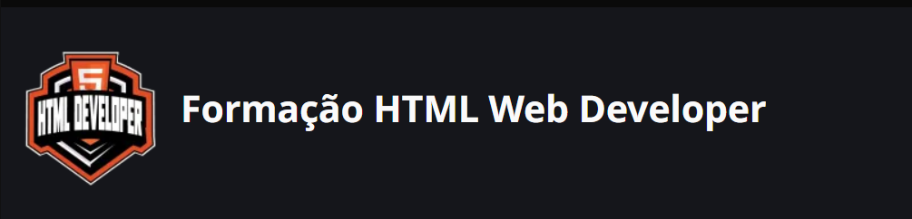

# Formação GitHub Certification

## Onboarding

Formação Dio que traz como objetivo entender como trabalhar com HTML, a base para criar suas primeiras páginas WEB! aprendemos prática a como estruturar a marcação da página html e como funciona cada tag, cada elemento semântico e outras boas práticas na hora de construir a primeira página. .

Aprofundamos algumas ferramentas como .

Curso apresnetado pelo Professor Diogo Medeiros da DIO.

# Modulos do curso

- [Primeiros Passos como HTML](./Primeiros%20Passos%20com%20HTML/README.md)
- [HTML I: Conceitos Básicos](./HTML%20I%20Coneceitos%20Basicos/README.md)
- [HTML II: Ampliando o Conhecimento](./HTML%20II%20Ampliando%20Conhecimento/README.md)

# links de apoio

[Apresentação Conteudos introdutórios](https://academiapme-my.sharepoint.com/:p:/g/personal/renato_dio_me/EWgg3UxUJt1GhLwXu6Z0L1cB7EhiHOoMQ-8vECmYXzDwYA?rtime=pDVgOzPx3Eg)
[HTML na PRática](https://academiapme-my.sharepoint.com/:p:/g/personal/renato_dio_me/EUBD7085ULpApq4i1_8fWfMBhVJQMyxt2K_d1sJOhRUN_w?e=vk37t3)
